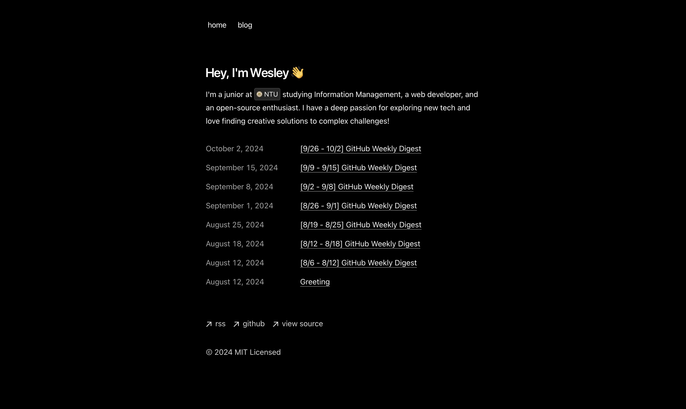

# GitHub Weekly Digest



This repository is designed to automatically generate a weekly digest of trending GitHub repositories using AI. The digest includes summaries of the repositories, highlighting their features and usage.

## 🤖 Features

- **AI-Powered Summaries**: Utilizes AI to generate concise summaries of trending repositories.
- **Weekly Updates**: Automatically scrapes and updates the digest every week.
- **Markdown Format**: Outputs the digest in a clean and readable Markdown format.
- **Customizable**: Easily modify the scraping and summarization logic to fit your needs.

## 🤖 How It Works

1. **Scraping**: The application scrapes the trending repositories from GitHub.
2. **Summarization**: Each repository's README is processed to generate a summary, including:
   - Overview
   - Key Features
   - Usage Instructions
3. **Output**: The summaries are compiled into a weekly digest in Markdown format.

## 🤖 How to Use

### Prerequisites

- [uv](https://docs.astral.sh/uv/getting-started/installation/) - Modern Python package manager
- [Bun](https://bun.sh/) - Frontend package manager

1. Clone this repository:

   ```bash
   git clone https://github.com/guan404ming/blog.git
   cd blog
   ```

2. Set up environment variables:
   - Create a `.env` file and add your API keys and other necessary configurations.

3. Install dependencies:

   **Python (Writer):**

   ```bash
   cd writer
   uv sync
   ```

   **Frontend:**

   ```bash
   cd frontend
   bun install
   ```

4. Run the application:

   ```bash
   cd frontend
   bun run dev
   ```

5. Check ```localhost:3000```

## 🤖 Contributing

Contributions are welcome! Please open an issue or submit a pull request for any enhancements or bug fixes.

## 🤖 License

This project is licensed under the MIT License.
